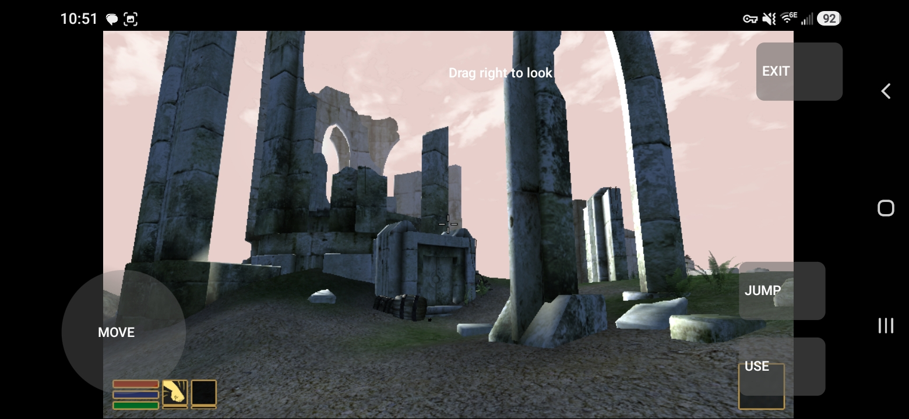
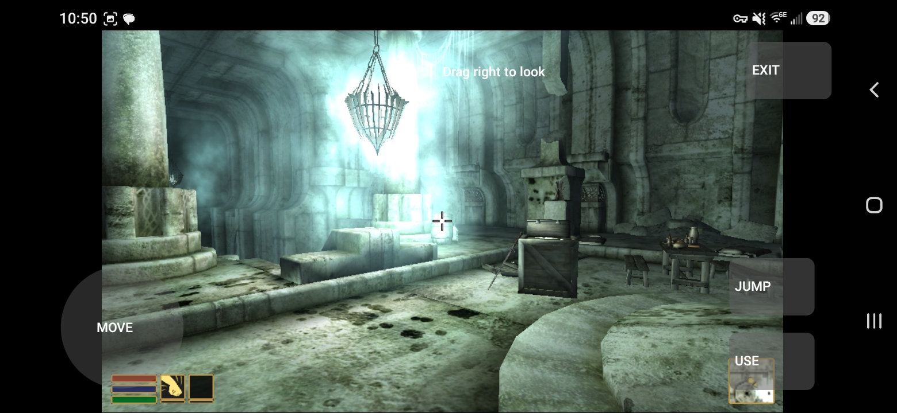
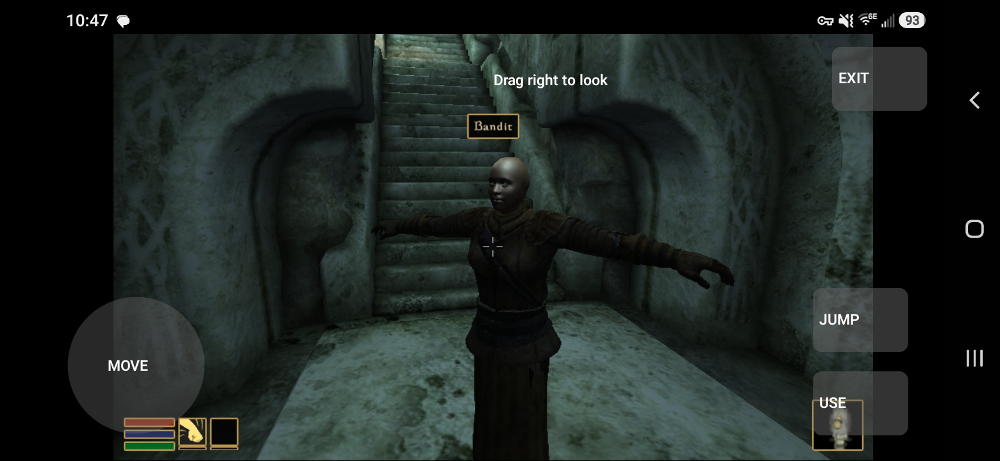

<div align="center">

# OpenOblivion

**A native Oblivion runtime, built toward persistent cooperative play.**

[](LICENSE)
[](https://github.com/madpai/OpenOblivion/actions/workflows/ci.yml)


[Progress](#progress-so-far) · [Build](#build-on-linux) · [Roadmap](docs/ROADMAP.md) · [Architecture](docs/ARCHITECTURE.md) · [Research](docs/research/FOUNDATION_COMPARISON.md)

</div>

OpenOblivion is an open-source project exploring a modern engine/runtime for
**The Elder Scrolls IV: Oblivion**, using the player's own game installation.
The goal is native Android and desktop play, Vulkan rendering and persistent,
server-authoritative cooperative RPG modes.

Think **OpenMW/TES3MP philosophy for Oblivion**, with the cooperative energy of
**Sven Co-op**: players can die, respawn and keep their progress. Multiplayer
rules should support shared adventures, dungeon runs, arena survival and
persistent Cyrodiil, while leaving room for a more faithful classic ruleset.

We start by researching and reproducing existing work. OpenMW is the selected
compatibility foundation; Vulkan and multiplayer integration remain separate
engineering milestones. See the [foundation decision](docs/decisions/0001-foundation.md).

## Progress so far

These are **real physical-phone captures from personal preview 0.3**, using
owner-supplied Oblivion data and our native touch overlay. This preview runs an
audited **OpenMW Android 0.51 / OpenGL** baseline. The screenshots show the
current compatibility checkpoint; Vulkan and multiplayer are still planned.



*Vilverin exterior: textured ruins, terrain and sky visible on Android.*

| Vilverin interior | Entrance stairs and NPC |
| --- | --- |
|  |  |
| Architecture, lighting and scene props render. | NPC assets load; original skeletal animation is unresolved. |

The phone playtest reports walking, stopping on release, ordinary collision,
jumping and looking around working. On private preview **0.5**, the owner now
reports very smooth stairs with subtle stepping they like, plus swimming and
a visible breath indicator. The uploaded log confirms the native camera filter
runs on the phone. Desktop Vilverin comparisons reduce measured view-jolt
variation by about **60% uphill / 76% downhill**, with movement checks passing.
**Next: match original Oblivion's movement speeds and jump behavior, then retest
stair flow at those settings.** Current movement fidelity is uncalibrated.
The Android engine builds from locked source dependencies; the working 0.3
phone baseline is archived and the earlier Lua experiment is withheld.

[Detailed evidence](docs/research/REPRODUCTION.md) · [Player movement work](docs/PLAYER_MOVEMENT.md) · [Screenshot provenance](docs/media/README.md)

## What is implemented

| Area | Current evidence |
| --- | --- |
| Classic TES4 inspection | Native read-only scanner using a pinned, unchanged OpenMW reader slice. Owner master scan: **1,167,017 records**, **85,079 groups**, **41,789 compressed records**. |
| Desktop reproduction | Separate unchanged OpenMW build loads private interior/exterior scenes and renders terrain, water and statics with software OpenGL. |
| Android preview | Original launcher, touch controls, private asset packaging and screenshot/QA upload tools. Phone scene visibility and look confirmed; basic traversal reported by the owner. |
| Native stair smoothing | Source-built Android 0.51 engine with an opt-in camera patch; desktop stairs/ramp/wall/ceiling checks pass. Phone log confirms activation; owner reports smooth stairs with subtle stepping. Original movement calibration remains. |
| Movement diagnostics | Native walk/stop/jump trajectories, original stair fixtures and separate player/view measurements. Discontinuities cannot count as successful movement. |
| Android toolchain | Inspector and Vulkan capability probe cross-compile for ARM64/API 29. |
| Vulkan | Device/graphics-queue enumeration only; no OpenOblivion Vulkan scene renderer yet. |
| Publication checks | Source, staged files and Git history checked for game data. Only three approved documentation screenshots have exact hash/size exceptions. |

This is an early engineering project. Original quests, combat, animation,
multiplayer authority and persistence have not passed their implementation
gates. There is no public playable release or public asset-packed APK.

## Where we are going

- Native **Android ARM64** and Linux development, with touch controls designed
  for actual player movement.
- **Vulkan** presentation and streamed Oblivion content from user installations.
- **Persistent cooperative PvE**, authoritative progression, death and respawn.
- Multiplayer-friendly alternate starts and original game modes, with Lua/data
  rules where appropriate.
- Increasing compatibility with classic Oblivion gameplay and mods, guided by
  measured content/runtime tests.

The [roadmap](docs/ROADMAP.md) defines acceptance gates rather than release dates.
The [multiplayer contract](docs/MULTIPLAYER.md) describes world ownership and
persistence; it is an architecture document, not a running server.

## Bring your own game data

**OpenOblivion distributes code, tools and documentation. You supply Oblivion.**

Game masters/plugins, BSA archives, NIF models, DDS textures, animations, audio,
game executables and proprietary physics binaries are excluded from public
history and CI. Personal test packages and raw QA reports remain private.
The selected progress screenshots are documentation captures, with separate
[provenance and rights](docs/media/README.md); they are not reusable game assets.

## Build on Linux

Requirements: C++20 compiler, CMake >= 3.24, Ninja, Python >= 3.10, Git,
zlib development files, Vulkan development files and LuaJIT for the movement
presentation fixtures. No game data is required
to build or run the public tests. The renderer-independent inspector can be
built with `-DOO_BUILD_VULKAN_PROBE=OFF`.

```sh
python3 tools/fetch_upstream.py --cache ../openoblivion-deps
cmake -S . -B build -G Ninja \
  -DOO_OPENMW_SOURCE="$PWD/../openoblivion-deps/openmw" \
  -DCMAKE_BUILD_TYPE=Debug
cmake --build build --parallel 4
ctest --test-dir build --output-on-failure
python3 tools/content_guard.py --history
./build/openoblivion-vulkan-probe
./build/openoblivion-inspect "/your/Oblivion/Data/Oblivion.esm"
```

The dependency cache must stay outside this repository. `fetch_upstream.py`
fetches an immutable commit and refuses to replace an existing dirty or
wrong-revision checkout. CMake verifies all upstream tracked blobs at configure
and build time. Source includes and notices stay in that original checkout.

Keep raw logs, game data, screenshots and compiled content outside this
repository. The inspector accepts a single classic `.esm`/`.esp` file by
explicit path; installation discovery and load-order resolution are future work.
Use trusted owner files: container budgets are not a complete untrusted-file
parser sandbox. Extended `XXXX` subrecords are skipped by the upstream reader;
the subrecord count is not a complete semantic census.

## Cross-compile for Android

Set `OO_NDK_DIR` to an installed NDK r28 directory:

```sh
cmake -S . -B build-arm64 -G Ninja \
  -DCMAKE_TOOLCHAIN_FILE="$OO_NDK_DIR/build/cmake/android.toolchain.cmake" \
  -DANDROID_ABI=arm64-v8a -DANDROID_PLATFORM=android-29 \
  -DANDROID_STL=c++_static -DCMAKE_BUILD_TYPE=Release -DBUILD_TESTING=OFF \
  -DOO_OPENMW_SOURCE="$PWD/../openoblivion-deps/openmw"
cmake --build build-arm64 --parallel 4
```

These are native command-line probes. The new runtime's Storage Access
Framework integration, touch controls and a Vulkan surface are not implemented.
Cross-compilation alone does not prove execution on a phone.

## Contributing and research

Start with the [charter](docs/PROJECT_CHARTER.md),
[architecture](docs/ARCHITECTURE.md), [roadmap](docs/ROADMAP.md) and
[maintainer handoff](docs/HANDOFF.md). Research existing implementations before
replacing subsystems. Keep upstream revisions, licenses and measured limits
visible; use original fixtures in public tests and owner content only locally.

Useful entry points: [format research](docs/research/FORMATS.md),
[Android preview tools](tools/android/README.md),
[desktop reproduction](tools/upstream/README.md), and
[backup/restore](docs/BACKUPS.md).

Original project code is **GPL-3.0-only**. Upstream retains its own licenses;
see the [license matrix](docs/research/LICENSE_MATRIX.md) and [notices](NOTICE.md).
Oblivion imagery and trademarks belong to their respective rights holders.
OpenOblivion is an independent project and is not affiliated with Bethesda.
