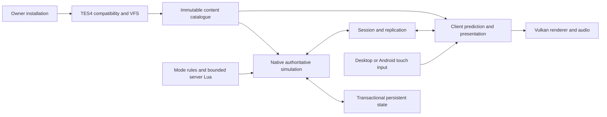

# Architecture direction

Status: intended runtime boundaries. Only the native reader wrapper and Vulkan
enumeration tool exist in this checkout. Build a second real consumer before
turning these boundaries into a broad framework.

## Content and runtime ownership

The TES4 adapter owns ESM/ESP load order, archives/loose-file lookup, NIF/KF
interpretation, original conditions and script VM compatibility. Keep original
provenance/record identity available; do not flatten away quest/script references
just to render geometry. The server and client consume the same immutable
resolved catalogue. Generic state contains entities, transforms, inventories,
equipment and effects; mode policy does not live inside a NIF loader.

User installation access is read-only. An optional private derived cache is
keyed by source/dependency hashes, adapter version and target representation,
with invalidation on change. No cache format becomes a public API before a
concrete viewer needs it. Asset Lab is optional tooling/inspiration rather than
a required conversion of every Oblivion asset into today's MegaMod packages.

Stable identity comprises plugin identity and source-local form ID; placed
reference identity is separate from actor/item definition identity. Dynamic
objects receive server-owned IDs tied to a persistent world/instance. Content
manifest identity includes ordered plugins and hashes, selected archives/loose
overrides, engine/adapter versions and rule-pack digest. Fail a mismatch before
admitting a player; do not silently map different load orders to shared state.

## Simulation and modes

Native C++ owns frequent movement, collision, combat validation, AI, equipment,
effects and event dispatch. The server owns health, resource consumption,
inventory/gold, loot creation, XP/skills, death and respawn. Clients send input
and interaction intentions. Lua can configure spawn rosters, rewards, timers,
death penalties and mode transitions through validated APIs; scripts do not
write arbitrary persistent state or accept a client's claimed reward.

An offline classic session uses an in-process authority with the same command
and state boundaries. Classic quest/death/save policy stays separate from
cooperative mode policy. Classic TES4 compiled scripts need a compatibility VM;
server Lua supplies new rules and is not a replacement for that VM.

Time advances under server policy; multiplayer menus cannot globally pause the
world. Instance ownership, encounters, quest state scopes and reset behavior
must be explicit. Reference respawn, corpse cleanup and player respawn are
different operations. The first mode bypasses the original prison/tutorial
start and enters an authored dungeon start without altering source plugins.

## Presentation and streaming

Presentation consumes bounded snapshots/events and immutable content. A client
can predict movement and animate locally while reconciliation resolves server
outcomes. Rendering must not mutate progression or become required by a
headless server. Start with a cell/interior, then adjacent exterior cells;
bound upload/decoding queues, cancel abandoned requests and unload inactive
resources. Cell transition never grants inventory or kills actors as a side
effect of graphics streaming.

Adopt renderer code only after a licensed Vulkan donor slice renders actual
TES4 meshes/materials. Prefer original debug geometry for public tests. GPU
resource lifetime, texture residency, shader compatibility and Android surface
loss are acceptance gates before world scale increases.

## Proposed code boundaries after the viewer gate

| Owner | Initial responsibility | Decisive proof |
|---|---|---|
| `compat/tes4` | Resolved content/VFS adapter around audited existing readers | One scene, matching records and load-order overrides |
| `simulation` | Authority and locally hosted single-player command path | Identical commands/state with headless vs local host |
| `server` | Sessions, persistence and interest management | Two clients, death/respawn, restart/reconnect |
| `client` | Prediction/input/UI/presentation | Correction and late join without duplicate effects |
| `render` | Vulkan resources and scene presentation | Desktop + ARM64 rendered scene, surface recovery |
| `modes` | Original cooperative, arena and classic policies | Same generic simulation with distinct tested rules |

These are proposed responsibilities, not empty modules created to imply
implementation. Concrete integration may stay in a small downstream fork
until the adapter boundary is justified by working content.

